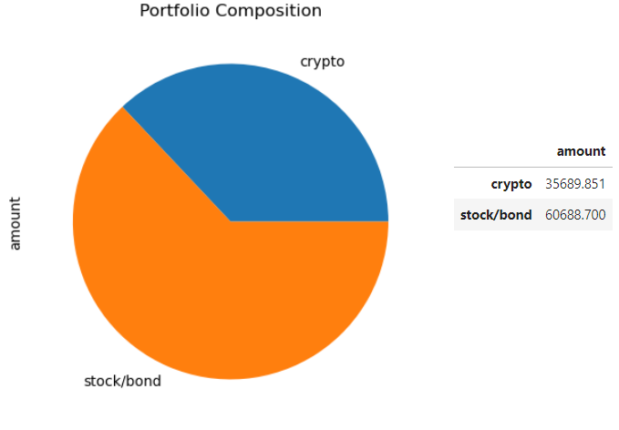
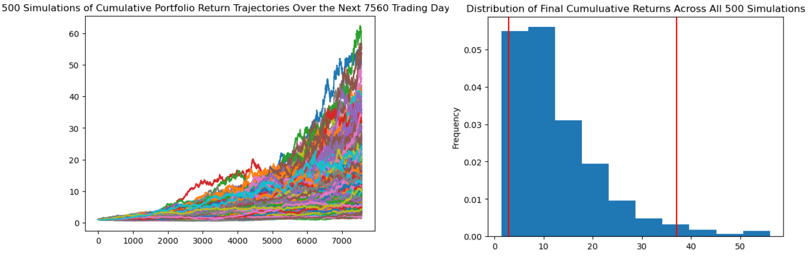

# Financial Planning Tool

This project entails building a tool to help credit union members evaluate their financial health. Specifically, members should be able to do two things:

1. Assess their monthly budgets. 
2. Forecast a reasonably effective retirement plan based on their current holdings of cryptocurrencies, stocks, and bonds. 

With these goals in mind, two tools are created in the Jupyter notebook:

* **A financial planner for emergencies**: Members will be able to use this tool to visualize their current savings, and they can then determine if they have enough reserves for an emergency fund.

* **A financial planner for retirement**: This tool will forecast the performance of their retirement portfolio in 30 years. To do this, the tool will make an Alpaca API call via the Alpaca SDK to get historical price data for use in Monte Carlo simulations.

---

## Technologies

The whole project is implemented in Python, writen in Jupyter lab using the Pandas library and matplotlib for plotting: 

* ```import pandas as pd```
* ```from pathlib import Path```
* ```%matplotlib inline```

We also import the necessary packages for creating the Alpaca object and getting historial price data for the assets considered:

* ```import os```
* ```import requests```
* ```import json```
* ```from dotenv import load_dotenv```
* ```import alpaca_trade_api as tradeapi```

And also those we'll used to run the Montecarlo simulations:

* ```from MCForecastTools import MCSimulation```

The main ```financial_planning_tools.ipynb``` file reads from the csv files contained in the 'Resources' folder.

---

## Usage

Run the main ```financial_planning_tools.ipynb``` in Jupyter Lab. 

In the **first part**, the portfolio composition and value is evaluated:

* The Cryptocurrency Wallet is evaluated by using the Python Requests library
* The Stocks and Bonds holdings are evaluated by using the Alpaca SDK

With all that info, we end up calculating and visualizing the composition and value of the member´s portfolio:



There is also an evaluation statement to determine if the member’s total portfolio is large enough to fund the emergency portfolio.

In the **second part**, a Monte Carlo simulation for the member’s savings portfolio is created. For this, we get 3 years of historical closing prices for a traditional 60/40 portfolio split (stock/bonds) via the Alpaca SDK, and then run a Montecarlo simulation of 500 sample for 30 years and also try a 80/20 composition for 10 years. 



Finally, we use the lower and upper `95%` confidence intervals to calculate the range of the possible outcomes for the current stock/bond portfolio and reach some conclusions on the member's chances to retire after a period of time.

---

## Contributors

Feature developed by Lourdes Dominguez [(LinkedIn profile)](https://www.linkedin.com/in/lourdes-dominguez-bengoa-12333044/)

---

## License

Use only for academic purposes.